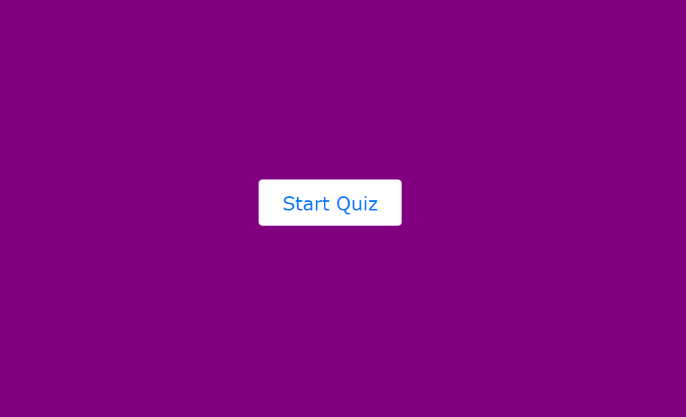
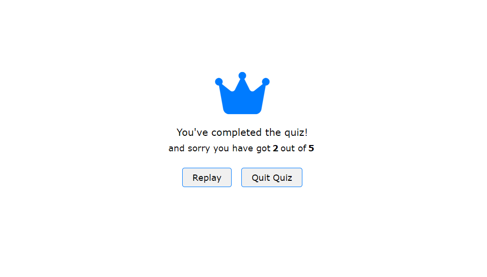

# Quiz App 

## Overview

This project is a quiz app designed to test users' knowledge on various topics. It's built progressively using HTML, CSS, and JavaScript.

## Sections

### 1. Splash Screen

The Splash Screen serves as a welcome introduction to the quiz, providing a visually appealing entry point for users.

### 2. Start Screen

The Start Screen features a button that initiates the quiz, signaling the beginning of the quiz-taking journey.

### 3. Rules for the Quiz

The Rules Screen informs users about the quiz rules, including time allotted for each question, total number of questions, and scores.

### 4. Results

The Results Screen displays users' performance after completing the quiz, including their score and possibly details about correct and incorrect answers.

## Project Structure

- `index.html`: Main HTML file containing the structure of the app.
- `styles.css`: CSS file for styling the app.
- `script.js`: JavaScript file for adding interactivity to the app.

## Getting Started

1. Clone the repository: `git clone https://github.com/livinalt/quizz_app`
2. Open `index.html` in a web browser.

## Future Improvements

- Add more quiz questions.
- Enhance the user interface for a more engaging experience.
- Implement a backend to store and retrieve quiz data.

## Contributors

Feel free to contribute to this project by forking the repository and submitting a pull request.

